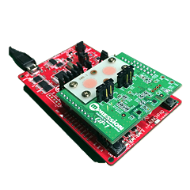
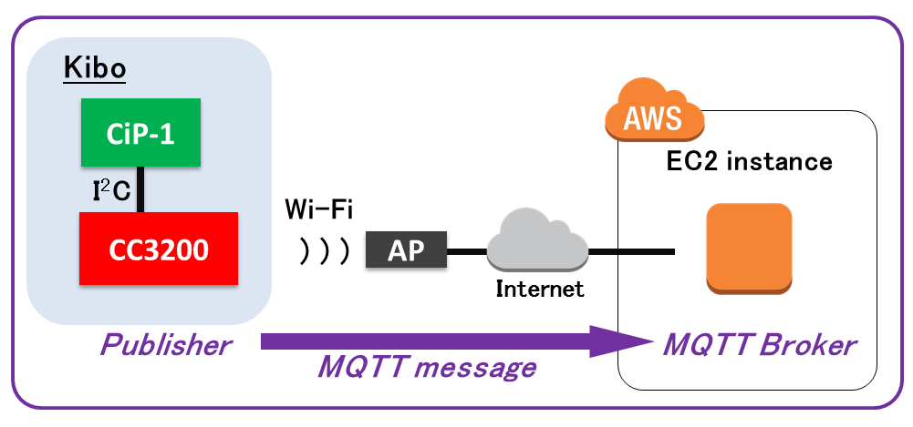

# Energia library for Kibo CiP-1

[](http://www.m-pression.com/ja/solutions/boards/cip1)

http://www.m-pression.com/ja/solutions/boards/cip1

## Usage

1. Clone this repo or download as a zip;
1. Unzip the zip file if you downloaded a zip file;
1. Copy the directory "KiboCiP1" into Energia's libraries directory;
1. Open Energia IDE, go to "File"->"Examples"->"KiboCiP1MQTTAutWiFi"

### KiboCiP1MQTTAutWiFi

For networks using WPA/WPA2 Personal encryption, you need the SSID and password.
You also need the MQTT broker IP address. 

```
// your network name also called SSID
char ssid[] = "energia1";
// your network password
char password[] = "launch  pad";
// MQTT Broker to use
char broker[] = "example.com";
```



## License

MIT